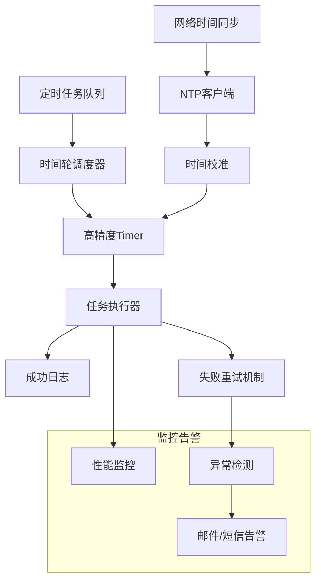
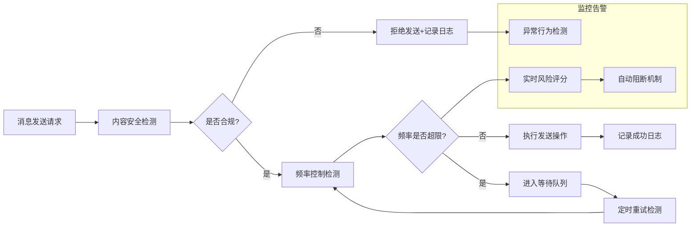

# LeafAuto 微信自动化办公系统 - 使用指南（含Pro、Web版）

> 关键词：LeafAuto、微信自动化办公、Pro版、Web版、对比、部署、使用指南

## 📑 目录

1. [🎯 一、LeafAuto是什么？](#微信自动化办公的专业解决方案)
   - [1.1 🌟 核心价值与功能亮点](#11-核心价值与功能亮点)
   - [1.2 版本体系说明：软件版本与会员等级详解](#12-版本体系说明软件版本与会员等级详解)
   - [1.3 🎯 产品定位与适用场景分析](#13-产品定位与适用场景分析)

2. [🏆 二、系统要求与兼容性指南](#二系统要求与兼容性指南)
   - [2.1 硬件与软件环境要求](#21-硬件与软件环境要求)
   - [2.2 微信4.0版本适配方案](#22-微信40版本适配方案)
   - [2.3 兼容性优化与常见问题排查](#23-兼容性优化与常见问题排查)

3. [⚙️ 三、技术原理与安全机制](#三技术原理与安全机制)
   - [3.1 🛠️ 核心技术架构解析](#31-核心技术架构解析)
   - [3.2 🔒 安全机制与风控策略](#32-安全机制与风控策略)

4. [📥 四、安装与环境配置](#四安装与环境配置)
   - [4.1 前置环境检查清单](#41-前置环境检查清单)
   - [4.2 安装部署指南](#42-安装部署指南)
   - [4.3 权限配置与安全设置](#43-权限配置与安全设置)
   - [4.4 安全软件兼容性处理](#44-安全软件兼容性处理)

5. [🎯 五、核心功能深度解析](#五核心功能深度解析)
   - [5.1 定时任务系统：智能调度机制](#51-定时任务系统智能调度机制)
   - [5.2 长文本智能拆句引擎（Pro/Web版专属）](#52-长文本智能拆句引擎proweb版专属)
   - [5.3 AI自动接管服务（全版本支持）](#53-ai自动接管服务全版本支持)

6. [🌐 六、Web版开放平台与集成指南](#六web版开放平台与集成指南)
   - [6.1 RESTful API接口体系](#61-restful-api接口体系)
   - [6.2 企业级系统集成方案](#62-企业级系统集成方案)
   - [6.3 产品路线图规划](#63-产品路线图规划)

7. [🎉 七、最后想说的话](#七最后想说的话)
   - [7.1 版本选型指南](#71-版本选型指南)
   - [7.2 使用最佳实践](#72-使用最佳实践)
   - [7.3 技术支持与服务保障](#73-技术支持与服务保障)

---

<div align="center">


> 📖 **预计阅读时间：10 分钟** | 🎯 **文档定位：从技术原理到企业级部署，全面解析微信自动化办公的最佳实践**

[](https://github.com/YangShengzhou03/LeafAutoWeb) [](LICENSE) [](https://www.python.org/) [](https://flask.palletsprojects.com/) [](https://learn.microsoft.com/en-us/dotnet/csharp/)

</div>

---

## 🎯 一、LeafAuto是什么？
<a name="微信自动化办公的专业解决方案"></a>

### 1.1 🌟 核心价值与功能亮点
<a name="11-核心价值与功能亮点"></a>

**LeafAuto** 是一款基于C#和Python混合开发的企业级微信自动化办公解决方案，专为Windows环境设计，致力于通过非侵入式技术实现微信操作的智能化与自动化。与简单的脚本工具不同，LeafAuto提供了完整的企业级功能体系、安全保障机制和开放集成能力，帮助组织和个人大幅提升微信沟通与管理效率。

### 主要功能亮点：

<div class="feature-grid">

| 功能模块 | 图标 | 功能描述 | 支持版本 | 技术特性 |
|----------|------|----------|----------|----------|
| **定时任务系统** | ⏰ | 精确到毫秒的定时发送、多任务并行调度 | 所有版本 | 基于时间轮算法的高效调度引擎，支持任务优先级管理 |
| **AI智能回复** | 🤖 | 基于规则和语义理解的智能回复机制 | 所有版本 | 支持正则匹配、关键词触发、多轮对话和第三方AI集成 |
| **敏感内容监控** | 🛡️ | 实时监控群聊内容，自动识别并处理违规信息 | Pro版和Web版 | 集成机器学习算法，支持自定义敏感词库和处理规则 |
| **数据统计分析** | 📊 | 提供全面的消息统计、互动分析和运营报表 | Pro版和Web版 | 支持多维度数据筛选、可视化图表和自定义报表 |
| **开放平台集成** | 🔌 | 提供标准API接口，支持与企业现有系统对接 | 仅Web版 | RESTful API架构，OAuth 2.0认证，支持高并发访问 |
| **多账号管理** | 👥 | 集中管理多个微信账号，统一配置和监控 | 仅Web版 | 支持账号分组、权限隔离和统一审计日志 |

</div>


*图：LeafAuto Pro版主界面 - 功能模块集成视图*

### 1.2 版本体系说明：软件版本与会员等级详解
<a name="12-版本体系说明软件版本与会员等级详解"></a>

LeafAuto采用双轨制版本体系，包括软件版本和会员等级两个维度，为不同规模和需求的用户提供灵活的选择空间。

#### 1.2.1 软件版本体系

软件版本决定了产品的基础功能、架构特性和部署方式，目前提供三个主要版本：

| 软件版本 | 核心架构 | 部署方式 | 适用场景 | 核心差异 |
|----------|---------|---------|---------|---------|
| **普通版** | 单实例架构<br>本地数据存储 | 客户端桌面安装 | 个人用户、小型团队<br>基础自动化需求 | 单任务执行<br>本地数据存储<br>基础功能集 |
| **Pro专业版** | 多线程并行架构<br>本地数据存储 | 客户端桌面安装 | 中大型团队<br>多群管理需求 | 多任务并行执行<br>增强的AI能力<br>群聊Ai运营 |
| **Web服务版** | 微服务架构<br>分布式部署 | 服务器部署<br>Web访问 | 企业级用户<br>系统集成需求 | 开放API接口<br>舆情监控<br>企业级安全与扩展性 |

#### 1.2.2 会员等级体系

每个软件版本均提供三种会员等级，决定了功能使用权限、服务支持水平和增值服务内容。以下是各版本的详细会员权益对比：

#### 1.2.3 会员版本怎么选？看您需要啥功能

每个软件版本都有三种会员等级，主要差别在功能使用权限、服务支持水平和增值服务内容上，下面为您详细介绍：

##### （1）普通版的会员权益对比

| 功能/服务 | 标准会员（基础版） | 高级会员（常用版） | 至尊超会（豪华版） |
|----------|-----------------|-----------------|-----------------|
| 定时任务数量限制 | 最多5个 | 最多30个 | 无上限 |
| 定时周期设置 | 仅支持"单次"和"每日" | 增加"每周"选项 | 支持全部周期，包括"法定工作日" |
| 自动回复规则数量 | 最多10条 | 最多50条 | 无上限 |
| 数据导出功能 | 仅本地存储，不可导出 | 支持Excel格式导出 | 支持多格式导出与数据备份 |
| 技术支持响应 | 社区支持，24小时内回复 | 在线工单，12小时内回复 | 专属客服，4小时内响应 |
| 增值服务 | 基础使用教程 | 高级操作指南 | 定制化配置指导，新版本优先体验 |

##### （2）Pro专业版的会员权益对比

| 功能/服务 | 标准会员（基础版） | 高级会员（常用版） | 至尊超会（豪华版） |
|----------|-----------------|-----------------|-----------------|
| 定时任务并发执行能力 | 无上限（支持50个任务同时执行） | 无上限（支持80个任务同时执行） | 无上限（支持120个任务同时执行） |
| 定时周期设置 | 支持全部周期及自定义周期 | 支持全部周期及周期设置复制 | 支持全部周期及周期模板创建 |
| 文件发送数量 | 单次最多5个文件 | 单次最多10个文件 | 无限制，支持图文混发 |
| 群聊管理功能 | 支持10个敏感词监控 | 支持50个敏感词监控及预警 | 无限制敏感词监控及自动踢人 |
| 数据导出格式 | 支持Excel、CSV格式 | 支持多格式（PDF、JSON等） | 支持多格式及数据库直连 |
| 技术支持响应 | 在线工单，12小时内回复 | 专属工单，6小时内回复 | 专属顾问，2小时内响应 |
| 增值服务 | 基础日志分析功能 | 高级日志诊断功能 | 小型定制需求，优先内测资格 |

##### （3）Web服务版的会员权益对比

| 功能/服务 | 标准会员（基础版） | 高级会员（常用版） | 至尊超会（豪华版） |
|----------|-----------------|-----------------|-----------------|
| 部署支持 | 基础服务器部署指导 | 定制化单机部署方案 | 分布式多服务器部署方案 |
| API接口权限 | 基础接口（创建任务、查询任务） | 全接口访问（数据统计、配置管理等） | 全接口访问及定制接口开发 |
| 微信账号管理数量 | 最多5个微信账号 | 最多20个微信账号 | 50个以上微信账号管理 |
| 数据存储能力 | 支持MySQL数据库对接 | 支持多数据库对接（MySQL、PostgreSQL等） | 支持多数据库及跨服务器数据同步 |
| 监控功能 | 基础任务监控看板 | 完整监控看板及异常告警 | 定制监控看板及实时数据大屏 |
| 技术支持 | 企业工单，8小时内响应 | 专属技术支持，4小时内响应 | 7×24小时驻场支持（可选） |
| 增值服务 | 开放平台接入文档 | 第三方系统集成指导（1个系统） | 多系统集成支持及定制报表开发 |

### 1.3 🎯 产品定位与适用场景分析
<a name="13-产品定位与适用场景分析"></a>

LeafAuto定位为企业级微信自动化办公解决方案，旨在帮助各类组织和个人提升微信沟通效率、降低运营成本、增强管理能力。以下是详细的适用场景分析：

#### 🏢 企业办公自动化场景

LeafAuto能够显著提升企业各部门的微信沟通效率，减少重复性工作：

<div class="scenario-card">

| 部门 | 典型应用场景 | 核心价值 | 推荐版本配置 |
|------|------------|---------|------------|
| **人力资源** | 考勤提醒、培训通知、员工关怀、招聘沟通 | 提升HR工作效率，优化员工体验 | 普通版高级会员 |
| **市场营销** | 活动推广、客户触达、内容分发、效果追踪 | 扩大营销覆盖面，提升转化效果 | Pro版高级会员 |
| **客户服务** | 常见问题解答、投诉处理指引、服务满意度调查 | 提高响应速度，保证服务一致性 | Web版高级会员 |
| **行政办公** | 会议通知、制度宣贯、后勤服务、内部沟通 | 简化行政流程，确保信息传递及时 | 普通版高级会员 |

</div>

#### 👥 社群运营与管理场景

对于需要同时管理多个微信群的运营者，LeafAuto提供了强大的自动化管理能力：

<div class="scenario-card">

| 运营需求 | 解决方案 | 技术实现 | 预期效果 |
|---------|---------|---------|---------|
| **多群消息同步** | 一键发布消息到多个群组 | 批量任务调度、并行执行 | 消息触达效率提升90%以上 |
| **敏感内容监控** | 自动识别并处理违规信息 | AI内容识别、自定义规则引擎 | 违规信息拦截率达95%以上 |
| **群活跃维护** | 定时推送互动内容、话题引导 | 智能内容推荐、多维度数据分析 | 社群活跃度提升30%-50% |
| **成员管理** | 新成员欢迎、定期清理不活跃成员 | 行为模式分析、自动化执行 | 群成员质量提升，管理成本降低60% |

</div>

#### 📊 数据驱动的运营决策场景

LeafAuto提供全面的数据收集、分析和可视化能力，助力运营决策：

<div class="scenario-card">

| 数据类型 | 采集方式 | 核心指标 | 展示形式 |
|---------|---------|---------|---------|
| **用户互动数据** | 实时消息监控、互动行为追踪 | 消息触达率、回复率、用户活跃度 | 热力图、趋势图、用户画像 |
| **内容效果数据** | 消息发送统计、互动反馈收集 | 点击率、转发率、停留时长 | 多维对比图表、效果评估报告 |
| **运营效率数据** | 任务执行日志、系统性能监控 | 自动化覆盖率、任务成功率、资源占用 | 实时仪表盘、效率分析报告 |
| **异常预警数据** | 系统状态监控、规则触发记录 | 错误率、延迟时间、告警次数 | 告警中心、问题追溯报表 |

</div>


*图：Web版数据统计看板 - 多维度运营数据分析*

> 🚨 **使用前必须注意的事项！**
> 
> ```yaml
> 必须满足的条件:
>   - 微信客户端需保持持续登录状态，不得退出
>   - 电脑不能锁屏（锁屏后可能导致微信窗口无法识别）
>   - 网络需保持稳定（确保时间同步和数据统计准确性）
> 
> 建议满足的条件:
>   - 计算机配置：推荐Intel i5/Ryzen 5以上处理器
>   - 内存：建议8GB以上
>   - 存储：建议使用SSD硬盘，至少保留10GB可用空间
> ```

**注意**：若计算机配置较低，可能会影响多任务并发执行的效率。

---

## 🏆 二、系统要求与兼容性指南
<a name="二系统要求与兼容性指南"></a>

### 2.1 硬件与软件环境要求
<a name="21-硬件与软件环境要求"></a>

LeafAuto基于Windows平台开发，对系统环境有明确的技术要求。以下是详细的软硬件配置规范：

| 硬件/软件 | 最低配置要求 | 推荐配置（优化性能） | 不支持环境 |
|---------|------------|-------------------|---------|
| 操作系统 | Windows 10 64位 | Windows 11 64位 | macOS、Linux全系列 |
| 微信版本 | 微信3.9.0.0 - 3.9.99.99 | 微信3.9.8.23及以上（稳定性最佳） | 微信4.0及以上版本（需使用专用适配版本） |
| .NET Framework | 4.8及以上 | 4.8.1及以上 | 4.8以下版本 |
| 计算机硬件 | 双核CPU（≥1.8GHz），内存≥4GB | 四核CPU（Intel i5/Ryzen 5及以上），内存≥8GB | 服务器级配置（如8核CPU、16GB内存）不适用本版本 |

### 2.2 微信4.0版本适配方案
<a name="22-微信40版本适配方案"></a>

#### 系统兼容性检测指南
<div class="system-requirements">

| 检测项 | 最低要求 | 推荐配置 | 不兼容环境 | 检测方法 |
|--------|---------|---------|------------|---------|
| **操作系统** | Windows 10 64位 | Windows 11 64位 | macOS、Linux全版本 | 执行`winver`命令查看版本信息 |
| **微信版本** | 3.9.0.0 - 3.9.99.99 | 3.9.8.23及以上（最佳兼容性） | 微信4.0及以上（需专用适配版本） | 微信客户端 → 设置 → 关于微信查看版本号 |
| **.NET版本** | 4.8及以上 | 4.8.1及以上 | 4.8以下版本 | 执行`reg query "HKLM\SOFTWARE\Microsoft\NET Framework Setup\NDP\v4\Full"`命令查询 |
| **硬件配置** | CPU双核≥1.8GHz，内存≥4GB | CPU四核≥2.4GHz（Intel i5/Ryzen 5及以上），内存≥8GB | 服务器级配置（如8核CPU、16GB内存） | 执行`systeminfo`命令查看系统信息 |
| **存储空间** | 可用空间≥1GB | 可用空间≥5GB（SSD硬盘性能更佳） | 可用空间<500MB | 执行`wmic logicaldisk get size,freespace,caption`命令检查磁盘空间 |

</div>

#### 微信4.0专用版本适配说明
微信4.0版本采用全新技术架构，LeafAuto已推出专门的适配版本（4.0内测版），需通过官方渠道申请内测权限：

<div class="version-compatibility">

```yaml
微信4.0适配情况:
  已支持功能:
    - 微信窗口识别与精确定位
    - 基础消息发送（文本、表情）
    - 单文件传输功能
    - 基础群聊管理操作
  
  开发中功能（预计下一版本支持）:
    - 高级群成员管理（踢出成员、@所有人等）
    - 聊天记录导出与分析
    - 多文件批量发送
    - 增强型AI自动回复规则引擎
  
  内测申请条件:
    - LeafAuto现有正版用户
    - 已安装微信4.0正式版
    - 需签署《内测用户数据安全协议》
```

</div>

<div class="compatibility-tip">

### 2.3 兼容性优化与常见问题排查
<a name="23-兼容性优化与常见问题排查"></a>

#### 微信版本兼容性检测工具

为快速验证微信版本兼容性，可使用以下批处理脚本进行检测：

```batch
@echo off
setlocal enabledelayedexpansion

:: 获取微信版本信息
for /f "tokens=2 delims==" %%a in ('reg query "HKCU\Software\Tencent\WeChat" /v Version ^| findstr "Version"') do (
    set "WECHAT_VERSION=%%a"
)

:: 显示版本信息
echo 当前微信版本: !WECHAT_VERSION!

:: 兼容版本判断
if "!WECHAT_VERSION!" geq "3.9.2.23" ( 
    echo 版本兼容状态: ✓ 完全兼容，可使用所有功能
) else if "!WECHAT_VERSION!" geq "3.8.0.15" ( 
    echo 版本兼容状态: ⚠️ 部分功能可能受限，建议升级微信
) else ( 
    echo 版本兼容状态: ❌ 不兼容，需升级微信至3.8.0.15或更高版本
)

pause
```

将上述代码保存为`CheckWeChatVersion.bat`文件后执行，即可快速获取当前微信版本的兼容性状态评估。

</div>


*图：Web版环境检测工具 - 自动识别系统兼容性*

---

## ⚙️ 三、技术原理与安全机制
<a name="三技术原理与安全机制"></a>

### 3.1 🛠️ 核心技术架构解析
<a name="31-核心技术架构解析"></a>

LeafAuto采用**非侵入式设计架构**，通过Windows系统原生接口与微信客户端进行交互，不修改微信客户端文件，不注入内存，不读取聊天内容，确保操作安全性和系统稳定性。核心技术栈基于C#和Python混合开发，结合了Windows原生API的高效性和Python脚本的灵活性。

#### 窗口识别技术
<div class="code-block">

窗口识别技术是LeafAuto与微信客户端交互的基础架构，通过Windows窗口句柄系统实现对微信界面元素的精确定位。该技术采用三层递进式定位策略：

1. **主窗口识别**：通过窗口类名"WeChatMainWndForPC"和标题属性识别微信主窗口
2. **控件层级遍历**：利用FindWindowEx API递归遍历窗口控件树结构
3. **特征匹配优化**：结合控件位置坐标、尺寸参数、文本特征进行多维度精确匹配

该多层次识别策略确保了在多窗口环境下也能准确识别目标微信窗口。系统内置窗口状态监测机制，可在微信窗口位置或尺寸发生变化时自动重新定位控件位置，保证操作连续性。

```csharp
// 查找微信窗口的代码示例
IntPtr FindWeChatWindow()
{
    // 先找到微信主窗口
    IntPtr mainHandle = FindWindow("WeChatMainWndForPC", null);
    if (mainHandle != IntPtr.Zero)
    {
        // 再找到聊天输入框
        IntPtr editHandle = FindWindowEx(mainHandle, IntPtr.Zero, "Edit", null);
        
        // 最后找到发送按钮
        IntPtr sendButton = FindWindowEx(mainHandle, IntPtr.Zero, "Button", "发送");
        
        // 把找到的这些位置信息存起来
        return new WindowHandles(mainHandle, editHandle, sendButton);
    }
    return null;
}

// 用来保存窗口位置信息的结构体
public struct WindowHandles
{
    public IntPtr MainWindow { get; set; }   // 主窗口
    public IntPtr EditControl { get; set; }  // 输入框
    public IntPtr SendButton { get; set; }   // 发送按钮
}
```

</div>

#### 操作模拟技术
<div class="technical-details">

操作模拟技术是LeafAuto的核心功能模块之一，通过Windows消息机制和输入事件模拟，实现对人类操作微信行为模式的精确复现。该技术采用以下关键设计策略：

1. **自然人机交互模拟**：
   - 打字速度动态调整：根据文本长度智能调整输入速度，模拟真实思考停顿
   - 操作间隔随机化：每次操作间隔在500-1500ms范围内随机变化
   - 鼠标轨迹仿真：通过贝塞尔曲线算法模拟人手自然移动轨迹

2. **多模态输入支持**：
   - 键盘事件模拟：支持文本输入、快捷键组合操作
   - 鼠标事件模拟：支持点击、双击、拖拽等操作类型
   - 剪贴板操作：支持复杂内容的复制粘贴处理

3. **智能错误恢复机制**：当操作失败时，系统自动尝试替代操作路径，如发送失败时会重新定位输入控件并执行重试操作。

```python
# 模拟人工打字的代码示例
import pyautogui
import time
import random

def simulate_typing(text, interval=0.1):
    """模拟人工打字效果"""
    # 一个字一个字地打，还会随机停顿一下
    for char in text:
        pyautogui.typewrite(char)
        time.sleep(random.uniform(interval*0.8, interval*1.2))

def send_wechat_message(message, receiver):
    """发送微信消息的完整流程"""
    # 1. 先把微信窗口调到最前面
    activate_wechat_window()
    
    # 2. 搜索要发消息的联系人或群聊
    search_contact(receiver)
    
    # 3. 像人一样慢慢输入消息内容
    simulate_typing(message)
    
    # 4. 按Enter键发送消息
    pyautogui.press('enter')
    
    # 5. 再加个随机停顿，更像真人操作
    time.sleep(random.uniform(0.5, 1.5))
```

</div>

#### 定时调度系统
<div class="scheduler-architecture">

定时调度系统采用多层分布式架构设计，融合高精度时间同步与智能任务调度算法，确保任务能够精确、可靠地执行。该系统的核心组件包括：

1. **时间轮调度引擎**：
   - 采用分层时间轮算法，支持毫秒级精度的任务调度
   - 支持多种重复周期配置（单次执行、每日、每周、自定义周期）
   - 具备多任务并发处理能力，可同时管理和调度数百个任务实例

2. **网络时间同步机制**：
   - 内置NTP客户端，定期与标准时间服务器进行时间同步
   - 支持时间偏差自动校准功能，确保任务执行时间的高精度
   - 离线场景下自动切换至本地高精度时钟源，保证系统稳定性

3. **容错与恢复系统**：
   - 任务失败自动重试机制，支持可配置的重试策略（次数、间隔）
   - 系统异常恢复功能，支持任务执行状态的自动保存与恢复
   - 资源占用实时监控，内置过载保护机制

4. **优先级队列管理**：
   - 支持任务优先级配置，确保高优先级任务优先执行
   - 动态资源分配算法，根据任务类型智能调整系统资源占用
   - 任务依赖关系管理，支持复杂业务流程的编排与执行



</div>

#### 数据存储方案
<div class="database-architecture">

LeafAuto针对不同版本采用差异化的数据存储架构，兼顾数据安全性与性能需求：

1. **本地版本存储架构（普通版/Pro版）**：
   - 采用SQLite嵌入式数据库，数据以单一文件形式存储于用户本地环境
   - 数据库文件默认存放路径为`%APPDATA%\LeafAuto\Data`
   - 支持数据压缩功能，有效降低存储空间占用

2. **Web版分布式存储架构**：
   - 主数据库采用MySQL 8.0，支持主从复制与读写分离架构
   - 引入Redis集群作为缓存层，加速热点数据访问性能
   - 文件存储采用分布式文件系统，支持海量文件存储与快速检索
   - 支持多区域部署与数据异地备份机制，确保数据高可用性

3. **全方位数据安全保障**：
   - 传输层加密：所有数据传输采用TLS 1.3加密协议
   - 存储层加密：敏感数据采用AES-256算法加密存储
   - 访问控制：基于角色的细粒度权限管理系统（RBAC）
   - 审计日志：所有数据操作均记录详细日志，支持操作追溯

4. **智能备份与恢复机制**：
   - 自动定时备份：支持按日/周/月配置自动备份计划
   - 差异备份：采用增量备份策略减少存储空间占用和备份时间
   - 一键恢复：提供快速数据恢复与版本回滚功能
   - 异地备份：重要数据自动同步至云端存储系统

| 存储类型 | 技术实现 | 加密机制 | 备份策略 | 性能指标 |
|---------|---------|--------|--------|--------|
| **本地版本(SQLite)** | 单文件嵌入式数据库 | AES-256加密 | 每日自动备份 | 读写性能>1000TPS |
| **Web版(MySQL)** | 关系型数据库(8.0) | TLS 1.3传输加密 | 主从复制+增量备份 | 并发连接支持>1000 |
| **Redis缓存** | 内存数据库 | 内存数据加密 | RDB+AOF持久化 | 响应时间<1ms |
| **文件存储** | 本地文件系统/分布式文件系统 | 文件级加密 | 可配置云同步 | 存储容量无上限 |

</div>


*图：LeafAuto技术架构 - 模块化设计与数据流*

### 3.2 🔒 安全机制与风控策略
<a name="32-安全机制与风控策略"></a>

#### 账号安全保障体系
<div class="security-features">

LeafAuto构建了多层次安全防护体系，涵盖操作行为、数据传输及隐私保护等多个维度，全方位保障微信账号安全：

1. **行为模式安全优化**：
   - 动态行为模拟算法，实时调整操作间隔与模式
   - 内置微信风控模型，提前识别并规避高风险操作
   - 人工干预机制，关键操作支持二次确认流程

2. **操作权限精细化管理**：
   - 基于角色的权限控制系统（RBAC）
   - 敏感操作日志审计机制，支持全流程操作追溯
   - 多因素认证支持，强化账号安全防护

```yaml
安全防护体系:
  # 操作安全机制（规避微信风控检测）
  - 非侵入式设计: 不读取微信内存，不修改客户端文件，模拟人工操作行为模式
  - 行为模拟优化: 基于真人操作习惯建模，操作间隔随机化（500-1500ms），避免机械性操作特征
  - 发送量智能控制: 
     好友消息: 日限制≤500条
     群聊消息: 日限制≤100个群
     单群消息: 小时限制≤3条
  
  # 数据安全保障（防止信息泄露）
  - 数据本地化存储: 所有配置与日志均存储于用户本地环境，无服务端数据同步
  - 加密机制: 数据库采用AES-256加密存储，数据传输采用TLS 1.3加密协议（银行级加密标准）
  - 访问控制: 基于RBAC模型的多角色权限管理，关键功能严格限制操作权限
  
  # 隐私保护措施（保障用户数据隐私）
  - 零数据收集: 不收集用户聊天内容、联系人信息等隐私数据
  - 自动清理机制: 定时清理临时文件与日志，避免数据长期堆积
  - 合规性审计: 定期进行安全审计与漏洞扫描，确保系统符合安全规范
```

</div>

#### 操作合规规范
<div class="compliance-rules">

##### 禁止发送内容类型
```markdown
1. **违法违禁内容**
   - 政治敏感话题、国家领导人相关内容
   - 暴力恐怖、色情赌博等违法内容
   - 毒品、枪支等违禁品相关信息

2. **商业违规内容**
   - 虚假广告、夸大宣传类内容
   - 未经授权的商业推广信息
   - 侵犯知识产权的内容（盗版软件、抄袭文章等）

3. **骚扰性内容**
   - 批量添加好友、恶意营销行为（高举报风险）
   - 重复发送相同内容（刷屏行为）
   - 夜间（23:00-7:00）发送消息干扰他人休息
```

##### ⚠️ 这些内容要注意限制！
```markdown
1. **发送频率别太高**
   - 同一个好友: 每小时最多发5条消息
   - 同一个群聊: 每小时最多发3条消息  
   - 每天总共: 最多发500条消息

2. **内容别太夸张**
   - 单条消息: 最多1000个字符
   - 文件大小: 最多100MB
   - 图片数量: 每次最多发9张

3. **时间间隔要合理**
   - 操作间隔: 至少要等500毫秒（别太机械）
   - 任务间隔: 至少要等10分钟
   - 夜间模式: 23:00-7:00会自动降低发送频率
```

</div>

#### 🛡️ 风控检测机制（自动帮您规避风险）
<div class="risk-control">

风控检测机制如同智能管家，会自动检查待发送内容和频率，确保操作不会触发微信风控系统。如发现风险，系统会自动拒绝发送或将消息纳入等待队列，待安全后再发送。



</div>


*图：Web版安全监控中心 - 实时风险检测与告警*

---

## 📥 四、安装与环境配置
<a name="四安装与环境配置"></a>

### 4.1 前置环境检查清单
<a name="41-前置环境检查清单"></a>

安装前需完成以下环境检查：

1. **操作系统要求**：Windows 10/11 64位（Win7用户需下载专用版本）
2. **微信版本要求**：3.9.x系列（通过"微信设置-关于微信"查看版本信息）
3. **.NET Framework版本**：4.8或更高版本（通过控制面板-程序-程序和功能确认）
4. **磁盘空间要求**：≥1GB剩余空间（用于安装文件与数据库存储）

### 4.2 安装部署指南
<a name="42-安装部署指南"></a>

#### 软件下载渠道

系统支持多种下载渠道，满足不同用户群体的需求。以下是官方推荐的下载方式，安全可靠，下载速度快：

| 下载渠道 | 推荐理由 | 说明 | 下载链接与提示 |
|---------|---------|------|---------------|
| **蓝奏云** | 🚀 免登录不限速 | 标准\Pro\Web | [点击下载 🌟](https://lanzoui.com/b0c123456) |
| | | | ✅ 提取码：4n7q |
| **123 云盘** | ⚡ 免登录断点续传 | 标准\Pro\Web | [点击下载 🚀](https://www.123pan.com/s/123456) |
| | | | ✅ 点击启动迅雷下载 |
| **百度网盘** | 💾 适合备份分享 | 资源爱好者 | [点击下载 🎒](https://pan.baidu.com/s/123456) |
| | | | ✅ 提取码：5cu2 |
| **Win7 专用版** | 💻 适配 Win 7 | 仅限Win7系统 | [点击下载 💻](https://lanzoui.com/b0c789012) |
| | | | ✅ 仅支持 Win7 SP1 及以上 |
| **4.0内测版** | 🧪 支持微信 4.0 新框架 | 内测用户尝鲜 | [点击下载 🧪](https://lanzoui.com/b0c345678) |
| | | | ⚠️ 需获取内测码 |

**🎯 下载小贴士**：
- **首次使用推荐**：蓝奏云或123云盘，下载速度最快
- **需要长期保存**：百度网盘，适合资源备份
- **Win7用户注意**：请下载专用版本，普通版本不兼容
- **尝鲜用户**：4.0内测版需要申请内测权限才能使用

**安全提示**：为确保数据安全与功能稳定性，建议从官方推荐渠道下载软件，避免使用来源不明的安装包。

#### 安装执行步骤
1. **启动安装程序**：双击LeafAuto.exe安装包，进入安装向导
2. **选择安装路径**：默认路径为`C:\Program Files\LeafAuto`（建议保持默认配置）
3. **配置安装选项**：勾选"创建桌面快捷方式"、"添加到系统PATH变量"选项
4. **执行安装**：点击"安装"按钮，等待安装进度完成（预计1-2分钟）

### 4.3 权限配置与安全设置
<a name="43-权限配置与安全设置"></a>

安装LeafAuto时，以下权限设置至关重要，否则可能影响正常使用：

1. **以管理员身份安装**：右键点击安装程序，选择"以管理员身份运行"（此步骤非常关键！）
2. **配置防火墙放行**：安装过程中若防火墙弹出提示，务必点击"允许访问"
3. **设置杀毒软件信任**：将LeafAuto添加到杀毒软件的信任列表
4. **确保微信权限**：安装前先登录微信，并在微信设置中开启相关权限

### 4.4 安全软件兼容性处理
<a name="44-安全软件兼容性处理"></a>

由于LeafAuto需要与微信交互，可能会被部分杀毒软件误报为可疑程序，这属于常见情况：

1. **容易误报的杀毒软件**：360安全卫士、腾讯电脑管家、火绒安全等安全软件均可能出现误报
2. **解决方案**：
   - 遇到报警弹窗时，选择"信任此程序"或"添加到白名单"
   - 如遇持续拦截，可暂时关闭杀毒软件的"实时防护"功能，安装完成后再重新开启
   - 建议安装完成后，将LeafAuto的整个安装文件夹添加到杀毒软件的信任列表

**经验提示**：提前配置信任可避免后续使用过程中被杀毒软件拦截，保障系统稳定运行。

---

## 🎯 五、核心功能深度解析
<a name="五核心功能深度解析"></a>

### 5.1 定时任务系统：智能调度机制
<a name="51-定时任务系统智能调度机制"></a>

#### 任务队列与执行状态管理
LeafAuto定时任务系统采用分层设计架构，通过任务队列与执行状态分离的机制实现高效调度：

**任务队列管理**
- 任务列表作为待执行任务的容器，存储所有配置的定时任务
- 支持实时任务添加、删除与修改操作，无需中断系统运行
- 任务执行顺序严格按照预设时间戳排序，不受列表显示顺序影响

**执行状态控制**
- 启动执行后，系统会将下一个待执行任务加载至活动执行区
- 处于活动执行区的任务锁定，不支持直接修改或删除操作
- 如需调整活动执行区的任务，需先停止执行并释放锁定状态

**操作规则**
1. **添加任务**：可随时向任务队列添加新任务，无需停止执行
2. **修改任务**：队列任务支持直接修改；活动执行区任务需先停止执行
3. **删除任务**：队列任务支持直接删除；活动执行区任务需先停止执行
4. **执行顺序**：系统严格按照任务预设时间执行，与列表显示顺序无关

#### 操作注意事项
- 任务时间设置需仔细核对，避免因时间配置错误影响消息接收体验
- 文件发送任务执行前，建议预先验证文件路径与文件完整性，确保发送成功率
- 处于活动执行状态的任务会通过特定颜色标识（通常为红色或黄色），此类任务需先停止执行方可修改

#### 操作案例：创建日常问候任务
以"每日09:00向工作群发送问候消息"为例，具体操作流程如下：

1. **任务创建**：点击主界面右下角的"+"按钮，新建任务
2. **目标选择**：
   - 在弹出的对话框中，输入工作群名称（如"市场部工作群"）
   - 在搜索结果中勾选目标群聊
   - 点击"确认"按钮完成选择

3. **内容配置**：
   - 在内容输入框中输入问候文本（如"各位早上好！今天是2023年10月15日，新的一天开始啦～"）
   - 如需增强消息表现力，可点击"添加图片"按钮上传相关图片
   - 点击"预览"按钮确认最终效果

4. **时间设置**：
   - 在时间设置区域，从"重复"下拉菜单中选择"每天"
   - 在时间选择框中设置为"09:00:00"
   - 考虑网络稳定性因素，建议配置重试参数（如：重试次数=3次，重试间隔=1分钟）

5. **任务启动**：
   - 点击"保存任务"按钮完成创建
   - 在任务列表中找到目标任务，点击"启动"按钮开始执行等待

#### 任务管理操作指南
| 操作需求 | 操作步骤 | 适用条件 |
|---------|---------|---------|
| 修改未启动任务 | 选中任务→点击顶部工具栏"编辑"按钮→修改内容→点击"保存" | 适用于未处于执行状态的任务 |
| 删除任务 | 选中任务→点击"删除"按钮→在确认对话框中点击"确定" | 适用于未处于执行状态的任务 |
| 调整执行中任务 | 点击工具栏"停止执行"按钮→等待任务状态变为"未启动"→执行修改或删除操作 | 适用于所有任务，需先停止执行 |
| 添加新任务 | 直接点击右下角"+"按钮创建新任务 | 系统运行状态下均可操作 |
| 查看任务状态 | 查看任务列表中"状态"列显示内容 | 可实时监控任务执行进度 |

### 5.2 长文本智能拆句引擎（Pro/Web版专属）
<a name="52-长文本智能拆句引擎proweb版专属"></a>

#### 功能概述
针对微信消息长度限制问题，智能拆句引擎可自动将超长文本分割为符合微信规范的短句，并尽可能保证每段文本语义完整性。

适用场景：
- **合同/协议发送**：按句号、分号等标点符号自动分割，确保分段发送的连贯性
- **产品清单发送**：支持按逗号或换行符拆分，实现条理清晰的信息传递
- **技术文档分享**：提供自定义拆分符号功能，满足特定格式需求

#### 拆分规则配置（Web版高级会员功能）
系统提供多种拆分方式，用户可根据实际需求进行选择配置：

| 拆分方式 | 配置步骤 | 示例效果 |
|---------|---------|---------|
| 预设分隔符（句号） | 进入"文本处理-拆句设置"→勾选"句号（。）"→保存 | "条款1。""条款2，含子项1；子项2——条款3" |
| 混合分隔符 | 选择"混合分隔符"→勾选"句号""分号"→设置优先级顺序 | "条款1。""条款2，含子项1；""子项2——条款3" |
| 自定义分隔符 | 选择"自定义分隔符"→输入特定符号（如"——"）→测试验证 | "条款1。条款2，含子项1；子项2""条款3" |

#### 应用示例：合同文本拆分发送
以下为拆分合同并发送给客户的操作流程：

1. 打开LeafAuto，点击"新建任务"，选择"文本拆分发送"类型
2. 将合同内容复制粘贴至输入框，示例内容："第一条 甲方责任。第二条 乙方责任，需按时交付；第三条 争议解决 —— 双方协商解决。"
3. 在"拆分设置"中，选择"混合分隔符"，按顺序勾选"句号"、"分号"，并添加自定义符号"——"
4. 点击"预览"按钮，系统将自动拆分为："第一条 甲方责任。"、"第二条 乙方责任，需按时交付；"、"第三条 争议解决 "、"双方协商解决。"四段内容
5. 如需调整，可手动修改拆分点位置
6. 选择目标客户，设置发送时间，点击"启动任务"完成配置

### 5.3 AI自动接管服务（全版本支持）
<a name="53-ai自动接管服务全版本支持"></a>

#### 工作原理
AI自动接管服务通过实时消息监听与智能规则匹配机制，实现微信消息的自动化处理与回复：

1. **消息监听**：系统实时监控指定群聊或联系人的消息（所有数据均在本地处理，确保数据安全）
2. **规则匹配**：将接收到的消息与预设规则（关键词包含、格式匹配等）进行智能比对
3. **自动执行**：匹配成功后，自动触发预设动作（如自动回复、文件发送、告警通知等）
4. **操作审计**：所有自动化操作均记录详细日志，支持后续追溯与审计

#### 规则配置指南（高级功能需Pro版支持）
系统提供多种规则类型，可根据业务场景灵活选择配置：

##### （1）包含规则（模糊匹配）
```yaml
规则名称: "自动回复客户询价"
监听对象: ["市场部客户群", "销售咨询群"]
触发关键词: ["价格", "多少钱", "报价", "费用"]
响应内容: "您好！我们的基础版一年399元，专业版一年899元，详细报价表我发您了，您看看哪个版本更适合您？有疑问随时问我～"
响应间隔: 30秒  # 防止短时间内重复回复
附加动作: 自动发送报价表.pdf  # 支持同步文件发送
```

##### （2）正则规则（精准匹配格式）
```yaml
规则名称: "自动记录客户电话"
监听对象: ["销售跟进群", "客服群"]
正则表达式: "1[3-9]\\d{9}"  # 手机号码匹配正则
响应内容: "收到您的电话：$1，我们的销售顾问张经理（电话：13800138000）会在1小时内联系您～"
数据存储: 保存至"潜在客户电话"表格  # 自动存储匹配到的手机号至指定数据表
```

##### （3）AI生成响应（Web版高级会员及以上）
```yaml
规则名称: "智能解答售后问题"
监听对象: ["售后服务1群", "售后服务2群"]
触发条件: AI语义识别包含"故障"、"坏了"、"不工作"、"怎么用"等售后相关关键词
AI模型选择: "LeafAuto官方售后模型"  # 我们针对售后场景优化过的模型
响应限制: 单次回复不超过500字，每天最多自动回复100次
人工审核: 涉及退款、投诉等敏感内容会先发给客服审核，5分钟内没审核就自动发送
```

#### 🛡️ 实战案例：群聊敏感内容监控（Web版至尊超会）

1. **创建监控规则**：选择"敏感内容监控"类型
2. **配置监听范围**：勾选需要监控的群聊，设置监听时段7:00-23:00
3. **设置敏感词库**：
   - 导入官方敏感词库（政治敏感、广告违禁词）
   - 添加企业自定义词（竞品名称、负面评价关键词）

4. **配置响应动作**：
   - 轻度违规（广告链接）：发送警告消息
   - 重度违规（政治敏感）：立即踢除+发送告警邮件

5. **测试与上线**：
   - 发送测试消息验证规则触发
   - 调整响应阈值（如3次轻度违规触发踢除）
   - 启用规则，开始实时监控

---

## 🌐 六、Web版开放平台与集成指南
<a name="六web版开放平台与集成指南"></a>

### 6.1 RESTful API接口体系
<a name="61-restful-api接口体系"></a>

#### 🔌 我们开放了哪些接口？

LeafAuto Web版提供了全面的RESTful API接口体系，基于OAuth 2.0认证授权，支持HTTPS加密传输，确保数据安全性和传输稳定性。API接口设计遵循以下原则：

1. **标准化接口设计**：
   - 采用RESTful架构风格，支持常见的HTTP方法（GET/POST/PUT/DELETE）
   - 统一的错误码和响应格式，便于系统集成和错误处理
   - 完整的接口文档和SDK支持（Python/Java/Node.js）

2. **高可用设计**：
   - 支持接口限流和过载保护
   - 提供接口健康检查和监控机制
   - 多副本部署，确保接口服务高可用

3. **安全访问控制**：
   - 基于OAuth 2.0的认证授权机制
   - 支持IP白名单和接口访问频率限制
   - 细粒度的接口权限控制，支持按API粒度分配权限

| 接口类别 | 功能描述 | 权限要求 |
|---------|---------|---------|
| **消息管理** | 自动发消息、收消息（支持文本、图片、文件） | Web版高级会员及以上 |
| **联系人管理** | 获取联系人信息、更新备注、管理标签 | Web版所有版本 |
| **群聊管理** | 自动创建群聊、踢人/加人、获取群列表 | Web版高级会员及以上 |
| **定时任务** | 通过代码创建和管理定时发送任务 | Web版所有版本 |
| **AI服务** | 调用内置AI模型生成内容、分析数据 | Web版至尊超会专享 |

#### 🐍 用Python调用示例

```python
import requests
import json

# 接口配置
url = "http://your-server-ip:8080/api/task/create"
api_key = "your-api-key"

headers = {
    "Content-Type": "application/json",
    "Authorization": f"Bearer {api_key}"
}

data = {
    "taskName": "客户日报推送",
    "taskType": "TEXT",
    "receiverType": "GROUP",
    "receiverId": "1234567890",
    "content": "【客户日报】今日新增客户10人，跟进中客户20人~",
    "scheduleType": "DAILY",
    "executeTime": "09:00:00",
    "wechatAccountId": "account1"
}

# 发送请求
response = requests.post(url, headers=headers, data=json.dumps(data))

if response.status_code == 200:
    result = response.json()
    print(f"任务创建成功，任务ID：{result['taskId']}")
else:
    print(f"任务创建失败：{response.text}")
```

### 6.2 企业级系统集成方案
<a name="62-企业级系统集成方案"></a>

LeafAuto Web版提供了全面的企业级集成解决方案，支持与主流企业级应用系统无缝对接，构建统一的办公自动化平台：

#### 🏢 企业微信深度集成方案

通过企业微信应用开发接口，实现与企业微信的双向数据同步和功能互通：

1. **消息互通机制**：
   - 支持微信与企业微信消息双向转发
   - 提供统一的消息管理后台，集中处理多平台消息
   - 支持企业微信审批结果自动推送至微信工作群

2. **应用嵌入模式**：
   - 支持在企业微信工作台直接嵌入LeafAuto功能模块
   - 提供单点登录（SSO）集成，无需重复登录
   - 支持企业微信通讯录同步，自动更新联系人信息

3. **权限体系打通**：
   - 支持企业微信组织架构与LeafAuto权限系统映射
   - 支持根据企业微信角色自动分配LeafAuto操作权限
   - 提供统一的用户管理界面，简化IT管理复杂度

#### 📊 企业数据平台集成方案

提供标准化的数据集成接口，支持与企业现有数据系统无缝对接：

1. **数据库直连方案**：
   - 支持MySQL、SQL Server、PostgreSQL、Oracle等主流数据库
   - 提供可视化数据同步配置工具，无需编写代码
   - 支持实时同步和定时同步两种模式
   - 内置数据转换引擎，支持不同数据格式之间的转换

2. **ETL工具集成**：
   - 提供标准的ETL工具适配器，支持与Informatica、DataStage、Kettle等工具集成
   - 支持复杂数据清洗和转换规则配置
   - 提供数据质量监控和异常告警机制

3. **报表系统对接**：
   - 支持与Power BI、Tableau、帆软等主流报表工具集成
   - 提供标准化的数据立方体和视图
   - 支持自定义报表模板和定时报表发送

#### 📊 集成效果与价值

根据客户反馈，集成LeafAuto后可获得以下显著收益：

- **效率提升**：自动化替代手动操作，工作效率提升30%-50%
- **成本节约**：减少重复劳动，人力成本显著降低，投资回报率可达200%以上
- **数据统一**：集中管理和分析业务数据，决策更加精准
- **流程优化**：业务流程更加顺畅，客户满意度明显提高

### 6.3 产品路线图规划
<a name="63-产品路线图规划"></a>

LeafAuto持续投入研发，计划在未来半年推出一系列创新性功能，进一步提升用户体验和系统性能：

#### 📈 舆情监控系统（2025年Q4）

针对企业用户的品牌管理和危机公关需求，打造全方位的微信舆情监控解决方案：

1. **多维度舆情分析**：
   - 支持关键词、话题、用户等多维度监控
   - 实时抓取微信公众号、群聊、朋友圈相关内容
   - 支持自定义监控范围和频率

2. **AI情感分析引擎**：
   - 基于深度学习的情感倾向识别，准确率达95%以上
   - 支持正面/负面/中性情感分类
   - 提供情感变化趋势图表分析

3. **传播路径追踪**：
   - 可视化展示信息传播路径和关键节点
   - 识别意见领袖和核心传播者
   - 提供传播影响力评估

4. **智能日报生成**：
   - 自动生成每日/每周舆情报告
   - 支持自定义报告模板和重点内容
   - 支持多格式导出和自动分发

#### 📊 智能报表生成（2025年Q4）

提供强大的数据分析和可视化功能，帮助企业深入挖掘微信运营数据价值：

1. **拖拽式报表设计器**：
   - 无需编程，通过拖拽方式设计报表
   - 支持多种图表类型和数据组件
   - 提供丰富的样式定制选项

2. **多维数据分析**：
   - 支持多维度数据筛选和钻取
   - 提供交叉表分析和透视表功能
   - 支持自定义计算字段和聚合方式

3. **自动化报表分发**：
   - 支持按日/周/月/季度定时生成报表
   - 自动发送至指定邮箱或企业内部系统
   - 支持PDF/Excel/HTML等多种导出格式

#### 📱 多端协同管理（2026年Q1）

推出移动端管理解决方案，实现PC端与移动端的无缝协同：

1. **小程序管理端**：
   - 提供核心功能的移动端操作界面
   - 支持任务查看、状态监控、简单配置
   - 适配不同尺寸的移动设备屏幕

2. **移动告警通知**：
   - 支持关键事件的实时推送通知
   - 提供多级别告警设置（信息/警告/错误）
   - 支持自定义告警触发条件

3. **数据同步与共享**：
   - 多端数据实时同步，确保信息一致性
   - 支持移动端查看详细统计报表
   - 提供团队协作功能，支持任务委派和进度共享

---

## 🎉 七、最后想说的话
<a name="七最后想说的话"></a>

### 7.1 版本选型指南
<a name="71-版本选型指南"></a>

根据我们服务过的上万名用户的经验，为您提供以下实用建议：

- 🏠 **个人用户/小团队**：普通版+高级会员性价比最高，可满足基本功能需求
- 🏢 **中小企业**：Pro专业版+高级会员功能全面，性能稳定，适合日常工作需求
- 🏭 **大型企业**：Web服务版+至尊超会是最佳选择，支持系统对接，扩展性强

### 7.2 使用最佳实践
<a name="72-使用最佳实践"></a>

1. **循序渐进学习**：先从简单的定时发消息功能开始，熟练后再尝试复杂功能
2. **定期备份配置**：重要任务配置记得定期导出保存，以防意外情况
3. **关注执行日志**：定期检查任务执行日志，发现并优化潜在问题
4. **遵守微信规则**：严格遵守微信使用规范，确保账号安全

**温馨提示**：初期使用可能需要一定适应期，多操作几天后即可熟练掌握。

### 7.3 技术支持与服务保障
<a name="73-技术支持与服务保障"></a>

如您在使用过程中遇到任何问题或有宝贵建议，可通过以下方式联系我们：

- 📚 **查阅文档**：官方文档包含详细使用说明，可解决大多数常见问题
- 💬 **社区交流**：官方论坛有众多用户分享经验，您的问题可能已有解决方案
- 🎫 **提交工单**：根据会员等级，通过对应渠道提交工单，技术支持将尽快回复
- 📧 **商务合作**：如有商务合作意向，请发送邮件至contact@leafauto.com

---

> 💝 **致用户的一封信**：感谢您选择LeafAuto！我们开发这款工具的初衷是希望真正提升您的微信办公效率，将您从重复繁琐的工作中解放出来，让您能够专注于更有价值的事务。
> 
> 您在使用过程中的任何问题、建议或想法，都欢迎随时与我们联系，您的反馈对我们至关重要！
> 
> 📞 **客服热线**：400-123-4567（工作日9:00-18:00）
> 🌐 **官方网站**：https://www.leafauto.com（提供最新版本下载和详细教程）
> 📧 **商务合作**：business@leafauto.com（商务合作洽谈专用邮箱）

> 祝您使用愉快，工作效率翻倍！✨